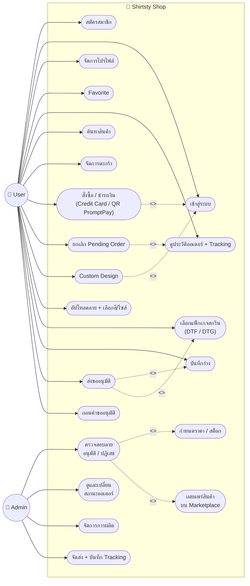
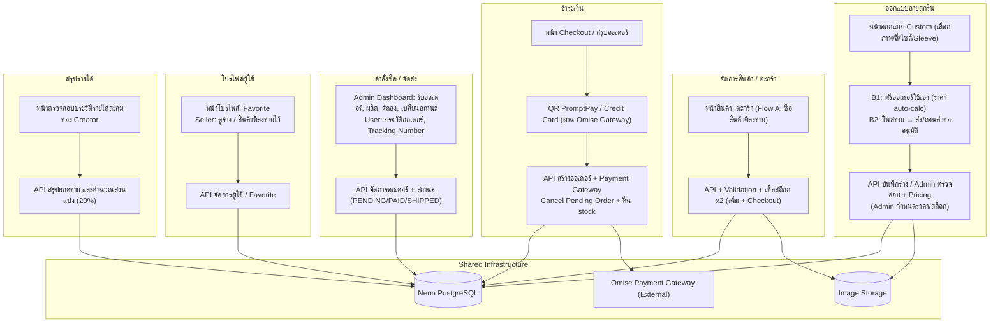
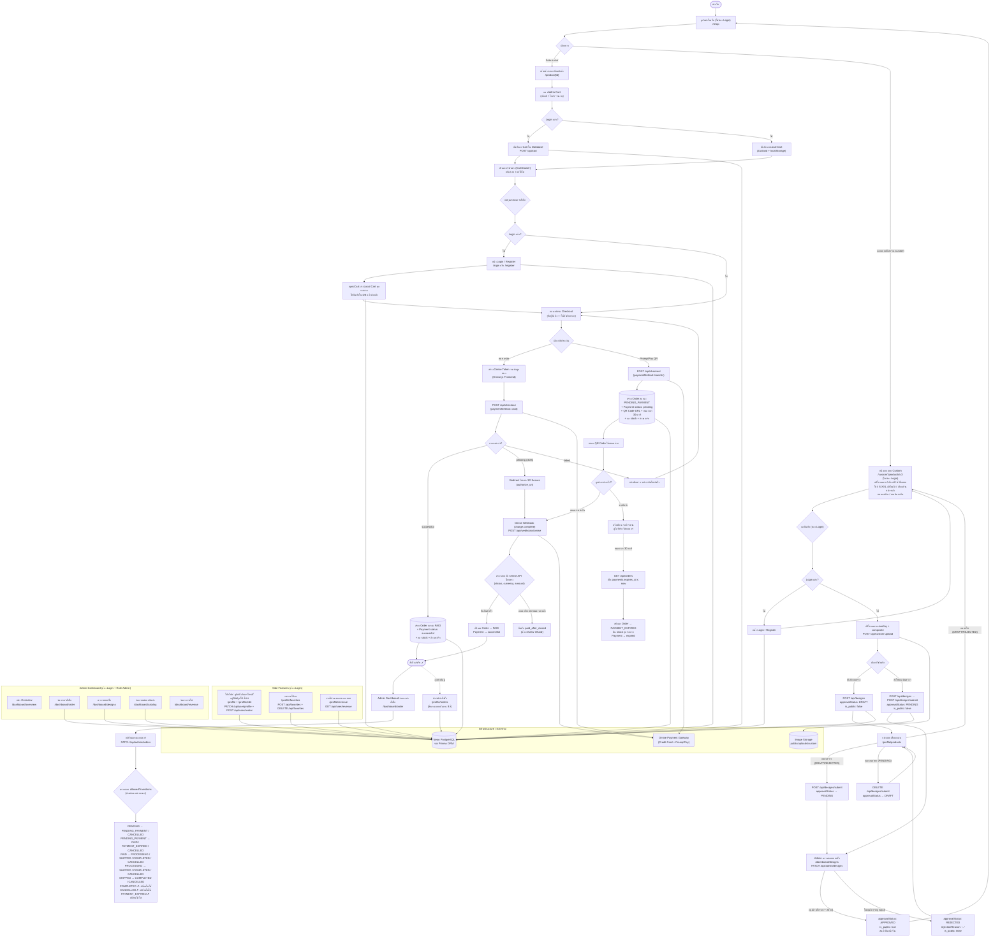

## ผู้พัฒนา

- 67113735 Awirut Jiensakul
- 67118021 Triopp Saibut
- 67156767 Phakjira Deechoi
- 67141535 Lalla Dodchare

# CustomShirt

🌐 **Website URL (Live Demo):** [https://csi-204-digital-platform-developmen.vercel.app](https://csi-204-digital-platform-developmen.vercel.app/)

---

ระบบร้านค้าออนไลน์ (E-commerce) สำหรับสั่งทำและสกรีนโลโก้ลงบนเสื้อยืด พัฒนาขึ้นเพื่อ **การศึกษารูปแบบการทำงานของระบบ E-commerce** ในรายวิชา CSI-204 Digital Platform Development

## วัตถุประสงค์ของโปรเจกต์

เพื่อศึกษาและฝึกปฏิบัติการออกแบบ/พัฒนาเว็บแอปพลิเคชันแบบ E-commerce ตั้งแต่การออกแบบโครงสร้างฐานข้อมูล หน้าเว็บ และฟังก์ชันการทำงานหลักของระบบร้านค้าออนไลน์ โดยใช้กรณีศึกษาเป็นร้านรับสั่งทำเสื้อสกรีนโลโก้ตามสั่ง (custom logo printing)

## เทคโนโลยีที่ใช้ (Tech Stack)

| ส่วน | เทคโนโลยี | เวอร์ชัน |
|---|---|---|
| Framework | [Next.js](https://nextjs.org/) (App Router) | 16.2.9 |
| UI Library | [React](https://react.dev/) | 19.2.4 |
| Styling | [Tailwind CSS](https://tailwindcss.com/) (v4, ผ่าน `@tailwindcss/postcss`) | ^4 |
| State Management | [Zustand](https://github.com/pmndrs/zustand) (พร้อม `persist` middleware เก็บตะกร้าไว้ใน localStorage) | ^5.0.14 |
| Icons | [lucide-react](https://lucide.dev/) | ^1.20.0 |
| Linting | [ESLint](https://eslint.org/) + `eslint-config-next` | ^9 |
| Fonts | `next/font/google` (Geist, Geist Mono) | - |

## โครงสร้างโปรเจกต์ (Project Structure)

```
csi-204-digital-platform-development/
├── app/
│   ├── layout.jsx        # Root layout: โหลดฟอนต์ Geist, ครอบ Footer ทุกหน้า
│   ├── page.jsx          # หน้า All Products (Navbar, Filters, รายการสินค้า, Pagination)
│   ├── globals.css       # Global styles + Tailwind
│   └── favicon.ico
├── components/
│   └── ui/
│       ├── CartDrawer.jsx   # ตะกร้าสินค้าแบบ Drawer: ดูตะกร้า, ลบสินค้า, Checkout, Popup สำเร็จ
│       └── Footer.jsx       # Footer ของเว็บไซต์ (เมนูจาก context/site.js)
├── context/
│   └── site.js           # ค่าคงที่ของไซต์ (NavbarMenu, FooterMenu)
├── store/
│   └── product.js        # Zustand store: cart, favorites, addToCart, removeFromCart, clearCart, toggleFavorite
├── public/                # Static assets (svg, ไอคอน)
├── package.json
└── README.md
```

> หมายเหตุ: ปัจจุบันหน้า **Shop (All Products)** ถูกพัฒนาไว้ใน `app/page.jsx` แล้ว ส่วนหน้า **Home, Blog, About** อยู่ในแผนของโครงสร้างเมนู (`NavbarMenu` ใน `context/site.js`) แต่ยังไม่ได้แยกเป็น route ของตัวเอง (`app/shop/`, `app/blog/`, `app/about/`) ตามแนวทาง Next.js App Router

### โครงสร้างหน้าเว็บ (Pages)

- **Home** – หน้าแรกแนะนำร้าน
- **Shop** – แสดงสินค้าทั้งหมด (All Products), ค้นหา, กรองสินค้า (หมวดหมู่/สี/ไซส์/แขนเสื้อ), อัปโหลดโลโก้, เพิ่มสินค้าลงตะกร้า
- **Blog** – บทความ/เนื้อหาเกี่ยวกับร้าน
- **About** – ข้อมูลเกี่ยวกับร้าน

## โครงสร้างฐานข้อมูลเบื้องต้น (Database Schema)

ออกแบบไว้สำหรับข้อมูลหลักที่ระบบต้องจัดเก็บ (ปัจจุบันฝั่ง frontend ยังจำลองสินค้าด้วย mock data และเก็บตะกร้าไว้ใน localStorage ผ่าน Zustand ยังไม่ได้เชื่อมต่อฐานข้อมูลจริง)

### `users`
| Field | Type | Description |
|---|---|---|
| id | PK | รหัสผู้ใช้ |
| name | string | ชื่อผู้ใช้ |
| email | string | อีเมล (ใช้ login) |
| password | string | รหัสผ่าน (hashed) |
| address | string | ที่อยู่จัดส่ง |
| phone | string | เบอร์โทร |
| role | enum | custuomer|
| created_at | datetime | วันที่สมัคร |

### `products`
| Field | Type | Description |
|---|---|---|
| id | PK | รหัสสินค้า |
| name | string | ชื่อสินค้า |
| description | text | รายละเอียดสินค้า |
| price | decimal | ราคา |
| category | string | หมวดหมู่ (T-Shirt, Polo, Hoodie, ...) |
| color | string | สี |
| size | string | ไซส์ (XS–XXL) |
| sleeve_type | string | ประเภทแขนเสื้อ |
| image_url | string | รูปสินค้า |
| stock | integer | จำนวนคงเหลือ |

### `logo_uploads`
| Field | Type | Description |
|---|---|---|
| id | PK | รหัสไฟล์ |
| user_id | FK → users.id | ผู้ที่อัปโหลด |
| file_url | string | ที่อยู่ไฟล์ภาพโลโก้ |
| file_name | string | ชื่อไฟล์ต้นฉบับ |
| uploaded_at | datetime | วันที่อัปโหลด |

### `orders`
| Field | Type | Description |
|---|---|---|
| id | PK | รหัสคำสั่งซื้อ |
| user_id | FK → users.id | ผู้สั่งซื้อ |
| status | enum | pending / paid / shipped / completed |
| payment_method | string | บัตรเครดิต / พร้อมเพย์ QR Code |
| total_price | decimal | ยอดรวม |
| created_at | datetime | วันที่สั่งซื้อ |

### `order_items`
| Field | Type | Description |
|---|---|---|
| id | PK | รหัสรายการ |
| order_id | FK → orders.id | คำสั่งซื้อที่เกี่ยวข้อง |
| product_id | FK → products.id | สินค้าที่สั่ง |
| logo_upload_id | FK → logo_uploads.id | ไฟล์โลโก้ที่ใช้สกรีน (ถ้ามี) |
| quantity | integer | จำนวน |
| price | decimal | ราคาต่อหน่วย ณ ตอนสั่ง |

## ฟังก์ชันการทำงาน (Features)

- **ดู All Products** – แสดงสินค้าทั้งหมดพร้อมค้นหาและกรองสินค้า (หมวดหมู่, สี, ไซส์, ประเภทแขนเสื้อ)
- **เลือกสินค้า** – ดูรายละเอียดสินค้า, อัปโหลดภาพโลโก้ที่ต้องการสกรีน
- **เพิ่มสินค้าลงตะกร้า (Add to Cart)** – เพิ่ม/ลบสินค้าในตะกร้า, ตะกร้าจะถูกจำไว้ในเครื่อง (localStorage)
- **ชำระเงิน (Checkout)** – เลือกวิธีชำระเงิน (บัตรเครดิต หรือ พร้อมเพย์ QR Code) แล้วยืนยันคำสั่งซื้อ
- **Popup สำเร็จการสั่งซื้อ** – แสดง popup แจ้งผลการสั่งซื้อสำเร็จหลัง checkout

## วิธีเริ่มใช้งาน (Getting Started)

### Marketplace approval flow

1. ผู้ใช้เข้าสู่ระบบและออกแบบเสื้อที่ `/custom`
2. บันทึกแบบร่างหรือส่งให้ผู้ดูแลตรวจจากหน้าออกแบบ
3. ผู้ใช้ติดตาม/ถอนคำขอ/ลบแบบได้ที่ `/profile/products`
4. ผู้ดูแลเปิด `/dashboard/designs` เพื่อกำหนดราคา จำนวนพร้อมขาย และอนุมัติหรือปฏิเสธ
5. สินค้าที่อนุมัติจะแสดงที่หน้าร้านทันที ส่วนแบบอื่นไม่สามารถใส่ตะกร้าได้

ระบบรูปภาพรองรับ Cloudflare R2 ผ่านตัวแปร `R2_*` ใน `.env.example` และ fallback เป็น `public/uploads` เมื่อพัฒนาในเครื่อง

### ตั้งค่าครั้งแรก / หลัง `git pull` (สำคัญ — ทำตามลำดับ)

> ทีมใช้ **ฐานข้อมูล cloud ตัวเดียวกันทั้งทีม** — schema และข้อมูลเริ่มต้น (roles) ถูกตั้งไว้บน DB กลางแล้ว
> ดังนั้น **ไม่ต้องรัน `prisma migrate` และ `prisma seed`** แค่ทำ 4 ขั้นนี้:

```bash
# 1. ดึงโค้ดล่าสุด
git pull

# 2. วางไฟล์ .env ที่ได้รับจากแชทส่วนตัวของทีม ไว้ที่ root ของโปรเจกต์
#    (ไฟล์นี้มี DATABASE_URL และ JWT_SECRET — ห้าม commit ขึ้น git เด็ดขาด)

# 3. ติดตั้ง dependencies (postinstall จะรัน `prisma generate` ให้อัตโนมัติ)
npm install

# 4. รัน
npm run dev      # เปิดเว็บที่ http://localhost:3000
```

**ข้อกำหนด:** ต้องใช้ **Node.js เวอร์ชัน 18 ขึ้นไป** (แนะนำ 20 หรือ 22) — เช็คด้วย `node --version`

> ⚠️ ถ้าแก้ `prisma/schema.prisma` แล้วโค้ดฟ้องว่าหา field/model ไม่เจอ ให้รัน `npx prisma generate` ใหม่อีกครั้ง

### คำสั่งอื่น ๆ

```bash
npm run build   # build สำหรับ production
npm run start   # รัน production server
npm run lint    # ตรวจสอบโค้ดด้วย ESLint
npm test        # รัน unit/integration test (jest)
```


## แผนภาพการทำงานของระบบ (System Diagrams)

### 1. แผนภาพแสดงการใช้งานระบบ (Use Case Diagram)


### 2. สถาปัตยกรรมโครงสร้างระบบ (System Architecture)


### 3. แผนภาพลำดับการทำงาน (Sequence Diagram)

```mermaid
sequenceDiagram
    title ระบบสั่งซื้อเสื้อผ้าออนไลน์พร้อมระบบออกแบบ Custom (Custom Apparel Platform)

    actor User as ลูกค้า / นักออกแบบ
    actor Admin as ผู้ดูแลระบบ (Admin)

    participant Browser as Browser / Next.js Client
    participant API as API Server (Next.js Routes)
    participant Omise as Omise Payment Gateway
    participant DB as ฐานข้อมูล (PostgreSQL via Prisma)

    %% ----------------------------------------------------
    %% 1. สมัครสมาชิก / เข้าสู่ระบบ
    %% ----------------------------------------------------
    Note over User, DB: 1. ระบบยืนยันตัวตน (Authentication)
    User->>Browser: กรอกข้อมูลสมัครสมาชิก / เข้าสู่ระบบ
    Browser->>API: POST /api/auth/register หรือ /api/auth/login
    API->>DB: บันทึก / ตรวจสอบข้อมูลผู้ใช้
    DB-->>API: ข้อมูลผู้ใช้ในระบบ
    API-->>Browser: ส่ง Session JWT Token (HTTP-Only Cookie)
    Browser-->>User: เข้าสู่ระบบสำเร็จ

    %% ----------------------------------------------------
    %% 2. จัดการโปรไฟล์
    %% ----------------------------------------------------
    Note over User, DB: 2. การจัดการข้อมูลส่วนตัว (Profile Management)
    User->>Browser: แก้ไขข้อมูลส่วนตัว (ชื่อ, เบอร์โทรศัพท์, ที่อยู่, Bio)
    Browser->>API: PATCH /api/user/profile
    Note over API: ตรวจสอบความถูกต้องของเบอร์โทรศัพท์ (10 หลักขึ้นต้นด้วย 0)
    API->>DB: บันทึกข้อมูลโปรไฟล์ใหม่ (User Model)
    DB-->>API: อัปเดตข้อมูลสำเร็จ
    API-->>Browser: ส่งข้อมูลโปรไฟล์ล่าสุดคืน
    Browser-->>User: แสดงข้อมูลโปรไฟล์ใหม่บนหน้าจอ

    %% ----------------------------------------------------
    %% 3. ออกแบบเสื้อผ้าด้วยตนเองและส่งตรวจ
    %% ----------------------------------------------------
    Note over User, DB: 3. การออกแบบเสื้อผ้า Custom และส่งขออนุมัติขาย
    User->>Browser: เข้าหน้าระบบออกแบบเสื้อ (Customizer)
    User->>Browser: อัปโหลดลายสกรีน (หน้า/หลัง) และปรับตำแหน่ง ขนาด พลิกรูปภาพ
    Browser->>API: POST /api/custom-upload (อัปโหลดรูปภาพสกรีนดิบ)
    API-->>Browser: ส่ง URL รูปภาพสกรีนที่เก็บใน Cloud Storage

    User->>Browser: กรอกชื่อแบบเสื้อ เลือกสี/ไซส์เริ่มต้น และกดยืนยันการบันทึก
    Browser->>API: POST /api/designs (ส่งพิกัด ขนาด และรูปพรีวิวเสื้อแบบ Composite)
    API->>DB: บันทึกแบบเสื้อเป็น Product (is_custom: true, approvalStatus: DRAFT)
    DB-->>API: บันทึกข้อมูลสำเร็จ (productId)
    API-->>Browser: ส่งรหัสการ์ดแบบเสื้อที่บันทึกแล้ว
    Browser-->>User: แสดงการบันทึกแบบร่างสำเร็จ

    User->>Browser: กดส่งแบบเสื้อขออนุมัติเพื่อโพสต์ขายบนเว็บ
    Browser->>API: POST /api/designs/submit (Payload: designId)
    API->>DB: อัปเดตสถานะ (approvalStatus: PENDING, submittedAt: Now)
    DB-->>API: บันทึกสถานะสำเร็จ
    API-->>Browser: อัปเดตสถานะสำเร็จ
    Browser-->>User: แสดงสถานะ "รอการตรวจสอบโดยแอดมิน"

    alt ถอนคำขออนุมัติ (ก่อนแอดมินตรวจสอบ)
        User->>Browser: กด "ถอนคำขอ" ในประวัติแบบเสื้อ
        Browser->>API: DELETE /api/designs/submit (Payload: designId)
        API->>DB: อัปเดตสถานะ (approvalStatus: DRAFT, submittedAt: null)
        DB-->>API: บันทึกสำเร็จ
        API-->>Browser: ถอนคำขออนุมัติสำเร็จ
        Browser-->>User: แบบเสื้อกลับเป็นสถานะแบบร่าง (DRAFT)
    end

    %% ----------------------------------------------------
    %% 4. แอดมินตรวจสอบและอนุมัติสินค้า
    %% ----------------------------------------------------
    Note over Admin, DB: 4. การพิจารณาอนุมัติโดยแอดมิน (Admin Design Review)
    Admin->>Browser: เข้าหน้าจัดการคำขอออกแบบเสื้อผ้า
    Browser->>API: GET /api/admin/designs
    API->>DB: ดึงรายการ Product (is_custom: true, approvalStatus: PENDING)
    DB-->>API: รายการแบบเสื้อทั้งหมดที่รอตรวจ
    API-->>Browser: แสดงแบบเสื้อพร้อมลายสกรีนบน Admin Dashboard

    alt แอดมินอนุมัติแบบเสื้อ
        Admin->>Browser: กรอกราคาขาย จำนวนสต็อกเริ่มต้น และกดอนุมัติ
        Browser->>API: PATCH /api/admin/designs (Payload: id, status: APPROVED, price, stock)
        API->>DB: อัปเดตตาราง Product (price, stock, approvalStatus: APPROVED, is_public: true, reviewedAt: Now)
        DB-->>API: อัปเดตสำเร็จ
        API-->>Browser: อนุมัติสำเร็จ
        Browser-->>Admin: แสดงผลการอนุมัติสำเร็จ (สินค้าขึ้นขายในหน้าหลักทันที)
    else แอดมินปฏิเสธแบบเสื้อ
        Admin->>Browser: กรอกเหตุผลการปฏิเสธ และกดปฏิเสธ
        Browser->>API: PATCH /api/admin/designs (Payload: id, status: REJECTED, reason)
        API->>DB: อัปเดตตาราง Product (approvalStatus: REJECTED, rejectionReason: reason, is_public: false)
        DB-->>API: อัปเดตสำเร็จ
        API-->>Browser: ปฏิเสธการอนุมัติสำเร็จ
        Browser-->>Admin: แสดงผลการปฏิเสธสำเร็จ (ผู้ใช้จะเห็นเหตุผลในหน้าประวัติเสื้อยืดและสามารถแก้ไขได้)
    end

    %% ----------------------------------------------------
    %% 5. ลูกค้ากด Favorite สินค้าที่ชอบ
    %% ----------------------------------------------------
    Note over User, DB: 5. ระบบรายการโปรด (Favorites)
    User->>Browser: กดที่รูปไอคอนหัวใจบนการ์ดสินค้า
    Browser->>API: POST /api/favorites หรือ DELETE /api/favorites (Payload: productId)
    API->>DB: บันทึกข้อมูลตาราง Favorite (userId, productId)
    DB-->>API: ทำรายการสำเร็จ
    API-->>Browser: ส่งผลการกด Favorite กลับมา
    Browser-->>User: แสดงการตอบสนองของไอคอนหัวใจ (เพิ่ม/ลด จากรายการโปรด)

    %% ----------------------------------------------------
    %% 6. ระบบตะกร้าสินค้าและขั้นตอน Checkout (Omise)
    %% ----------------------------------------------------
    Note over User, DB: 6. ระบบการสั่งซื้อและชำระเงินผ่าน Omise (Cart & Checkout Flow)
    User->>Browser: เลือกดูสินค้า และเลือกไซส์/สี/จำนวน แล้วกดเพิ่มลงตะกร้า
    Browser->>API: POST /api/cart (Payload: productId, quantity, size, color)
    API->>DB: สร้าง/อัปเดต Cart และ CartItem ในฐานข้อมูล
    DB-->>API: บันทึกสำเร็จ
    API-->>Browser: ส่งข้อมูลสินค้าทั้งหมดในตะกร้าล่าสุด
    Browser-->>User: แสดงการอัปเดตตะกร้าสินค้าในหน้าเว็บ

    User->>Browser: กดชำระเงินและป้อนข้อมูลที่อยู่จัดส่ง
    
    alt จ่ายเงินผ่านบัตรเครดิต (Credit Card)
        User->>Browser: เลือกช่องทางบัตรเครดิตและกรอกรายละเอียดบัตร
        Note over Browser, Omise: สร้าง Token ของบัตรโดยตรงผ่าน Omise.js SDK
        Browser->>Omise: ส่งข้อมูลบัตรเครดิต
        Omise-->>Browser: ส่งกลับ cardToken
        Browser->>API: POST /api/checkout (Payload: paymentMethod: "card", cardToken, shippingAddress)
        
        Note over API: ค้นหารายการในตะกร้า คำนวณราคาจริงจาก DB และเช็คสต็อกสินค้า
        API->>DB: ตรวจสอบสต็อกใน Product Model (stock >= quantity)
        DB-->>API: ผลลัพธ์สต็อกเพียงพอ
        
        API->>Omise: สร้างรายการชำระเงิน (Omise Charge) ด้วยเงินสกุล THB (สตางค์) และระบุ cardToken
        Omise-->>API: ผลการทำรายการชำระเงิน (Charge Object)
        
        alt ชำระเงินผ่านบัตรสำเร็จทันที
            Note over API: ดำเนินการตัดสต็อกสินค้าใน Transaction ของ Database
            API->>DB: หักสต็อกสินค้า, สร้างใบสั่งซื้อ (Order status: PAID), บันทึก payments ในฐานข้อมูล
            DB-->>API: บันทึกข้อมูลและหักสต็อกสำเร็จ
            API-->>Browser: ชำระเงินสำเร็จ (Redirect ไปยังหน้ายืนยันรายการสั่งซื้อ)
            Browser-->>User: แสดงผลหน้าจอชำระเงินสำเร็จ
        else ต้องตรวจสอบความปลอดภัยขั้นสูง (3D Secure)
            API->>DB: ลดสต็อกชั่วคราว, สร้างใบสั่งซื้อ (Order status: PENDING), บันทึก payments (status: pending)
            DB-->>API: บันทึกข้อมูลสำเร็จ
            API-->>Browser: ส่งกลับ url (authorizeUri)
            Browser->>User: เปิดป๊อปอัปให้ผู้ใช้ยืนยันรหัส OTP ของธนาคาร
            User->>Omise: ยืนยันรหัส OTP สำเร็จ
            Omise->>API: ส่ง Webhook POST /api/webhooks/omise (Event: charge.complete)
            API->>Omise: ตรวจสอบความถูกต้องของสถานะการชำระเงินโดยตรงกับ API
            Omise-->>API: คืนค่าสถานะ Charge (Status: successful)
            API->>DB: อัปเดตใบสั่งซื้อ (Order status: PAID) และอัปเดต payments (status: successful)
            DB-->>API: บันทึกสถานะชำระเงินสำเร็จ
            API-->>Omise: ตอบกลับ Webhook สำเร็จ (200 OK)
            Browser-->>User: แสดงผลหน้าจอชำระเงินเสร็จสิ้น
        end

    else จ่ายเงินผ่านพร้อมเพย์ (PromptPay QR Code)
        User->>Browser: เลือกช่องทางพร้อมเพย์และกดยืนยันชำระเงิน
        Browser->>API: POST /api/checkout (Payload: paymentMethod: "transfer", shippingAddress)
        
        Note over API: ตรวจสอบราคาในตะกร้าและเช็คสต็อกสินค้าจาก DB
        API->>DB: ตรวจสอบและหักสต็อกสินค้าชั่วคราวใน Transaction
        DB-->>API: ดำเนินการหักสต็อกสำเร็จ
        
        API->>Omise: ส่งคำขอสร้างรายการชำระเงิน (Omise Charge) ระบุ source: promptpay
        Omise-->>API: ส่งข้อมูลพร้อม URL ภาพ QR Code ของ PromptPay
        API->>DB: สร้างใบสั่งซื้อ (Order status: PENDING_PAYMENT), บันทึกข้อมูลพร้อมลิงก์ QR และวันหมดอายุ (30 นาที)
        DB-->>API: บันทึกข้อมูลสำเร็จ
        API-->>Browser: ส่งลิงก์ภาพ QR Code คืนหน้าบ้าน
        Browser-->>User: แสดงรูปภาพ QR Code พร้อมเพย์ให้ลูกค้าบันทึกภาพไปสแกนจ่ายเงิน

        User->>Omise: เปิดแอปพลิเคชันธนาคารและสแกนชำระเงิน
        Omise->>API: ส่ง Webhook POST /api/webhooks/omise (Event: charge.complete)
        Note over API: ตรวจสอบลายเซ็น webhook และยืนยันความถูกต้องของจำนวนเงินกับ API Omise
        API->>Omise: ดึงสถานะ Charge ID เพื่อยืนยันโดยตรง
        Omise-->>API: คืนค่าสถานะยืนยันชำระเงินจริงสำเร็จ (status: successful)
        API->>DB: ทำธุรกรรม SQL อัปเดต (Order status: PAID) และอัปเดต payments (status: successful)
        DB-->>API: บันทึกรายการสำเร็จ
        API-->>Omise: ตอบกลับ Webhook สำเร็จ (200 OK)
        Browser-->>User: ระบบอัปเดตหน้าประวัติการสั่งซื้อเป็น "ชำระเงินแล้ว" อัตโนมัติ
    end

    %% ----------------------------------------------------
    %% 7. การอัปเดตการขนส่งโดยแอดมิน
    %% ----------------------------------------------------
    Note over Admin, DB: 7. การอัปเดตสถานะขนส่ง (Shipping Management)
    Admin->>Browser: เข้าหน้าแอดมินจัดการคำสั่งซื้อเพื่อระบุเลขพัสดุ
    Browser->>API: PATCH /api/admin/orders (Payload: orderId, carrier, trackingNumber)
    API->>DB: บันทึกเลขพัสดุใน Shipping Model และเปลี่ยนออเดอร์ (Order status: SHIPPED)
    DB-->>API: อัปเดตความคืบหน้าสำเร็จ
    API-->>Browser: บันทึกข้อมูลสำเร็จ
    Browser-->>Admin: แสดงผลการส่งข้อมูลพัสดุเรียบร้อย
    API-->>User: ลูกค้าเปิดประวัติสั่งซื้อจะเห็นสถานะ "กำลังจัดส่ง" พร้อมเลขพัสดุ
```


### 4. แผนภาพเส้นทางการไหลของข้อมูลการทำงานระบบ (System Flowchart)
